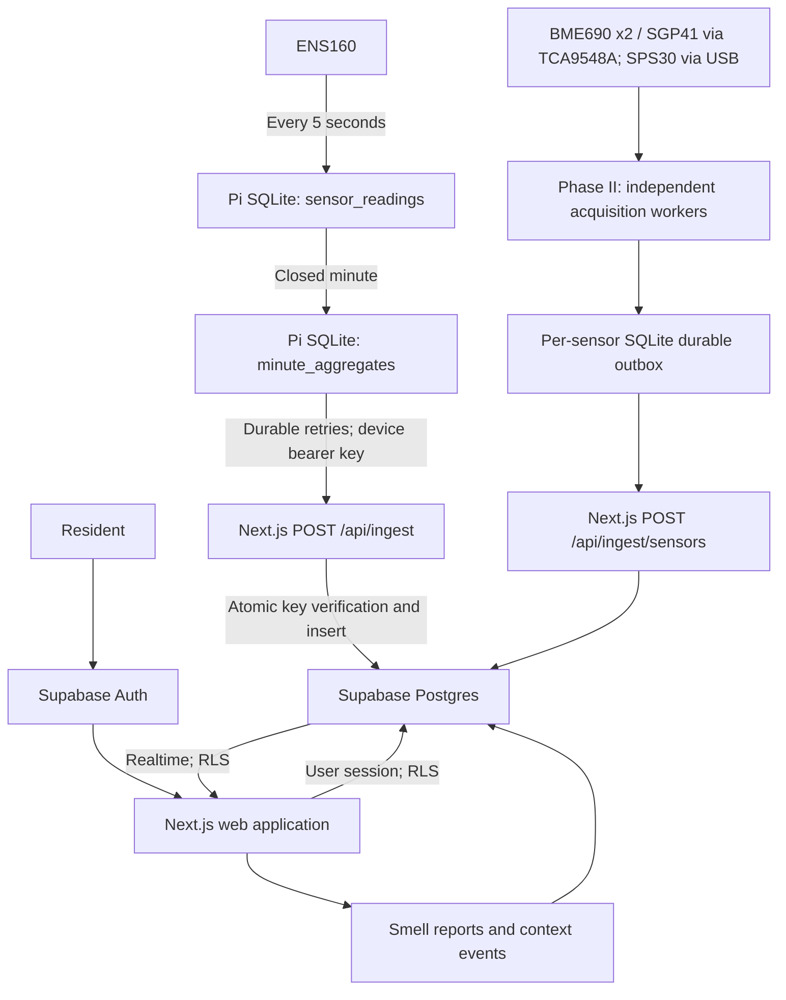

# Digital Nose — Phase II: Sensor Array

Digital Nose is an open-source distributed odour-monitoring platform combining low-cost edge sensors, Raspberry Pi telemetry, resident observations, and cloud analytics.

Visit [digitalnose.ai](https://digitalnose.ai), [explore the demo](https://digitalnose.ai/demo), or [open the dashboard](https://digitalnose.ai/dashboard).

Licensed under Apache License 2.0. Provided as is, without voluntary warranties. Read the [warranty, liability and safety notice](DISCLAIMER.md) before building or relying on a setup.

Phase II adds independent multi-sensor acquisition, durable per-sensor outboxes, raw telemetry and sensor analysis to the existing ENS160 foundation. Sensor measurements remain the primary record; resident smell reports, room context and weather support calibration dataset collection.

## Project phases and status

| Phase | Scope |
| --- | --- |
| **Phase I — Foundation** | Original Raspberry Pi ENS160 collector, aggregator, sync, database/dashboard and initial real-world data collection. |
| **Phase II — Sensor Array** | TCA9548A, two BME690 sensors, SGP41 and SPS30; independent raw acquisition, durable outboxes, multi-sensor telemetry and calibration dataset collection. |
| **Phase III — SSM / ML (future)** | Dataset analysis, feature engineering, calibration, restaurant versus not-restaurant modelling, validation and Raspberry Pi inference. |

The Phase II application and acquisition software are implemented and locally tested. The additive database migrations have been applied to the existing project. Deployment of the new application endpoint and Pi acquisition services, physical sensor verification and the full-array soak remain pending. New acquisition entries and publishing are disabled by default; no model or inference service is included.

See the [Phase II architecture and measurement contract](docs/phase-ii.md), [Phase II acquisition and deployment guide](docs/phase-ii-acquisition.md), and [database rollout record](docs/phase-ii-rollout.md).

## Architecture



Next.js App Router, TypeScript, Tailwind CSS, Supabase Postgres/Auth/Realtime. No ORM, external queue service, external charting package, or global state library. The ENS160 chart plots every selected minute without smoothing; missing minutes remain gaps. Phase II sensor charts use bounded buckets retaining mean, minimum, maximum and count; the inspector retrieves original observations. eCO₂ is an equivalent estimate from ENS160, not a direct CO₂ measurement.

## Local development

Requirements: Node.js 22.12+ and npm. Python 3.10+ is needed only for the Pi tests.

```sh
npm ci
cp .env.example .env  # only if .env does not already exist
# Fill in the variables below.
npm run dev
```

Open `http://localhost:3000` (the default). To use the Phase II review port, run `npm run dev -- --port 3001` and configure the local application origin and Auth redirect for `http://localhost:3001`. The public `/demo` route works without a connected sensor or migrated database. It displays clearly labelled illustrative data; its context and report controls do not write to Supabase.

The local `.env` is ignored by Git. Never overwrite an existing `DEVICE_KEY_PEPPER`: changing it invalidates every device key.

| Variable                        | Purpose                                                                              |
| ------------------------------- | ------------------------------------------------------------------------------------ |
| `NEXT_PUBLIC_SUPABASE_URL`      | Your Supabase project URL                                                            |
| `NEXT_PUBLIC_SUPABASE_ANON_KEY` | Supabase **publishable** key (or legacy anon key); compatibility variable name       |
| `SUPABASE_SERVICE_ROLE_KEY`     | Supabase **secret** key (or legacy service-role key); server-only compatibility name |
| `DEVICE_KEY_PEPPER`             | At least 32 random characters; generate with `openssl rand -hex 32`                  |
| `APP_URL` / `NEXT_PUBLIC_APP_URL`           | Canonical application origin, e.g. `http://localhost:3000` or your HTTPS deployment  |

Only variables prefixed `NEXT_PUBLIC_` may enter browser code. The privileged Supabase client imports `server-only`. The ingestion endpoint uses the server secret; resident requests use the resident session and RLS.

## Supabase setup

For a new database, apply the versioned migrations through the Supabase CLI. For an existing installation, first compare the live schema and migration history with the [Phase II rollout record](docs/phase-ii-rollout.md). Do not replay migrations already applied through the SQL editor or use an unreviewed `db push`. The CLI tracks migrations recorded in its history.

API keys configure the app; **they cannot apply database migrations**. Use the Supabase CLI with your project management access and database password:

```sh
npx supabase login
npx supabase link --project-ref YOUR_PROJECT_REF
npx supabase db push
```

Review the linked project before pushing. This installs the versioned files in `supabase/migrations/` in order: domain schema and RLS, atomic ingestion, Realtime publication, the owner-only resident directory, weather and maintenance context, and the additive Phase II sensor registry, ingestion and query functions. No Docker is required for this hosted workflow. `supabase/config.toml` also describes the project for CLI use.

Alternatively run the migration files in order in the project's SQL editor, each inside a transaction. If you use the SQL editor, reconcile the CLI migration history with `supabase migration repair --status applied <version>` before later using `db push`.

In Supabase Auth:

1. Enable email/password sign-up and email confirmation.
2. For production, use `https://digitalnose.ai` with `https://digitalnose.ai/auth/confirm` as an allowed redirect. Set the Site URL to `NEXT_PUBLIC_APP_URL` and allow `<origin>/auth/confirm` in Redirect URLs, for development and production origins you use.
3. After configuring custom SMTP (required by the hosted template editor), set the **Confirm signup** email link to `{{ .RedirectTo }}?token_hash={{ .TokenHash }}&type=email`. This supports confirmation on a different browser/device. The callback also supports a PKCE `code`.
4. Configure your production SMTP sender and appropriate Auth rate limits before inviting residents.

Create and confirm an account. On the first dashboard visit, create a site. Its creator becomes its owner in one database transaction. In Settings, give your profile a name, add a device, and generate its device key. The key is displayed once and only its peppered HMAC-SHA256 digest is stored. Rotation revokes previous keys atomically.

### Confirmation link recovery

An email can be confirmed even if automatic sign-in fails, for example when the default PKCE email link is opened in another browser. Sign in with the registered email and password in that case. Confirmation links are single-use; reopening one can return `otp_expired`. The login page explains these outcomes and offers **Resend confirmation email** for an unconfirmed account. Use only the newest link and open it in the browser used for signup. No account is automatically confirmed or password reset by this recovery flow.

### Residents

The application uses a simple invitation process: the owner shares the displayed sign-up URL, the resident signs up, and the owner adds that registered email in Settings. No mail provider or invitation table is required. Owners can remove residents; residents cannot change membership or device settings. Owner removal/transfer is deliberately not exposed, preventing accidental removal of the last owner.

### Optional database demo data

The `/demo` route needs no seeding. To populate a separate, explicitly labelled demo site for an **existing account**:

```sh
npm run seed -- your-registered-email@example.com
```

The seed writes 24 hours of minute aggregates and adds the account as owner of that demo site. It does not create accounts, send email, seed real device keys, or mix generated values into a real site. Use a development Supabase project for database demos.

## Daily use

- **Dashboard:** select a site/device, view latest readings and 6H / 24H / 7D history, and switch between TVOC, eCO₂ and AQI. Phase II adds independent sensor health, gas/particulate/environment charts and a shared moment inspector. A table exposes the latest 60 measurements for accessibility.
- **I can smell it:** choose intensity 1–5 and optionally a smell type or note. The database records the event time.
- **Context:** window state is shared by the site; occupancy is the signed-in resident's own latest state. An unrecorded value is shown as unknown. Maintenance periods exclude overlapping ENS160 minutes from interpretation without deleting measurements. Window-open periods use very light blue, closed periods warm ivory, and maintenance light grey, with explicit labels. Every change appends an event; there is no persistent `smell_present` flag.
- **Reports:** recent observations with access to older pages.
- **Settings:** profile, site details, residents, device metadata and key rotation/revocation. Owner controls are checked again server-side and by the database.

All timestamps are stored in UTC and displayed in the site's named local timezone, initially Europe/London (including daylight saving changes). The latest minute's age determines freshness; stale values are labelled after three minutes. A successfully replayed old upload does not make an old measurement look live.

Realtime subscribes to the active device's aggregates and the site's reports/context. Reconnection and a one-minute polling fallback recover missed changes without requiring a page reload. Supabase RLS controls Realtime visibility too.

## Phase II Raspberry Pi setup

Use the [Phase II acquisition and deployment guide](docs/phase-ii-acquisition.md) for exact staged copy, install and bring-up commands. The current Pi installation is:

| Item | Actual setup |
| --- | --- |
| Project directory | `/home/diginose/digital-nose` — not a Git repository |
| Account / Python | `diginose` / Python 3.13.5; already in `i2c` and `dialout` |
| Existing services | `digitalnose.service`, `digitalnose-aggregator.service`, `digitalnose-sync.service` |
| New package / environment | `/home/diginose/digital-nose/phase2/`, `/home/diginose/digital-nose/.venv-phase2` |
| New state directory | `/var/lib/digitalnose/phase2` |
| I2C baseline | `/dev/i2c-1`: 0x10 DFRobot HAT, 0x53 ENS160; 0x70 absent before mux connection |

Copy only `edge/raspberry-pi/phase2/` into the new package directory. Preserve the existing Phase I files, Python environment, SQLite database and three services. The [original Pi guide](docs/raspberry-pi.md) is a Phase I reference implementation; its generic installation paths are not the layout of this Pi.

Each new sensor has separate acquisition and publishing service instances (`digitalnose-sensor-acquire@` and `digitalnose-sensor-publish@`). Bring up the mux and each sensor individually. Do not enable publishing until the approved application deployment exposes `/api/ingest/sensors`. Hardware and Python 3.13.5 dependency validation must be completed on the Pi before continuous operation.

The Pi receives only its collector identifier, application ingest URL and device API key, never the Supabase server secret. ENS160 five-second samples stay local; its existing minute aggregates continue to upload. New Phase II sensors queue independent raw observations for delivery to Supabase.

## Phase I ENS160 ingest contract

`POST /api/ingest`, `Content-Type: application/json`, `Authorization: Bearer <device-key>`.

```json
{
  "device_identifier": "diginose-001",
  "minute_start_utc": "2026-09-12T02:10:00Z",
  "tvoc_mean": 180.2,
  "tvoc_min": 165,
  "tvoc_max": 201,
  "eco2_mean": 651.3,
  "eco2_min": 630,
  "eco2_max": 670,
  "aqi_max": 2,
  "sample_count": 12
}
```

A successful upload returns `200 {"ok":true}`, including retries of a previously stored minute. The first accepted aggregate is immutable: duplicates are ignored. Key verification, insertion and `last_seen_at` update are atomic. Revoked keys and keys belonging to another device return 401. Bodies are limited to 4 KiB; timestamps must align to a UTC minute; bounds and min/mean/max relationships are validated. Partial minutes with 1–12 valid samples are accepted.

Errors: 400 invalid payload, 401 invalid credentials, 413 oversized body, 415 wrong content type, 503 temporary ingestion/configuration failure. The sync client retains unacknowledged rows and retries with capped exponential backoff. A batch consists of up to 50 individual minute requests, matching the single-record endpoint.

## Phase II sensor ingest contract

`POST /api/ingest/sensors` accepts one independently timestamped sensor observation per request, using the existing collector bearer key. Payloads include schema version, collector identifier, sensor identity/type, observation time, sequence number, validity/status and typed measurements. The maximum body size is 16 KiB. Exact retries are idempotent; conflicting observations are rejected.

See the [complete field definitions and labelled example payloads](docs/phase-ii.md#7-ingestion-contract). ENS160 continues to use `/api/ingest`; it is not moved onto the new raw-observation endpoint.

## Phase II application deployment

1. Import this Git repository into Vercel using the Next.js preset and Node.js 22 or later. The repository root is the app root.
2. Set the required application environment variables for the deployment environment. For digitalnose.ai, set `APP_URL=https://digitalnose.ai` (takes precedence over the legacy `NEXT_PUBLIC_APP_URL`). Add the domain to the Vercel project and configure the DNS records shown by Vercel. In Supabase Auth URL Configuration, set Site URL to `https://digitalnose.ai` and allow `https://digitalnose.ai/auth/confirm`. Keep localhost redirects if you use local development. Redeploy after changing the environment variable. Keep the pepper stable and server secrets out of preview environments that do not need production access.
3. Apply the Supabase migrations and configure Auth URLs/email as described above.
4. Run `npm run check`, `npm run test:pi`, and `npm run build` before deploying.
5. Deploy only after review and approval. On a new installation, create the account/site/device and provision its key through Settings. On the existing installation, retain the site, device identity and key.
6. Verify a real upload, a retry, a revoked key, and a live dashboard in the deployed environment. Use Vercel's platform request controls if the public endpoint receives abusive traffic.

Do not cache authenticated pages at a CDN. The app marks session responses private/no-store. Its server actions use Next.js origin checks; production origin configuration must match the deployment.

## Security and validation

See [security model](docs/security.md) and [verification](docs/verification.md).

```sh
npm run check          # ESLint, TypeScript, Node tests including real Postgres RLS via PGlite
npm run test:pi        # SQLite aggregation, retry, outbox and failure tests
npm run build         # Production Next.js build
npm run format:check
```

PGlite is a development-only embedded PostgreSQL test dependency. Tests create roles, Auth stubs and isolated databases, then execute the real schema and ingestion migrations. They do not contact or modify your hosted project. Production continues to use Supabase only.

## Author

Digital Nose was created by [Piotr Wolanski](https://piotrwolanski.com/).

## License

Licensed under the Apache License 2.0.
See [LICENSE](LICENSE) and [NOTICE](NOTICE) for details.

## Disclaimer of warranty and limitation of liability

Digital Nose is provided **as is**, without warranties or conditions except where required by applicable law or agreed in writing. There is no promise that the software, setup instructions or hardware integration will be error-free, compatible with every device, continuously available or suitable for a particular purpose.

The warranty disclaimer and liability limitations in **sections 7–9 of the [Apache License 2.0](LICENSE)** apply. These address failures and losses arising from use or inability to use the project, subject to the exceptions in the licence and applicable law. Nothing here excludes liability that cannot lawfully be excluded, including death or personal injury caused by negligence where the law prohibits that exclusion, fraud, or mandatory consumer rights.

Digital Nose is an observational tool, not a certified safety alarm or a basis for deciding that air is safe. Review the [full warranty, liability and safety notice](DISCLAIMER.md), follow component manufacturers’ instructions and keep backups before changing an existing installation.


## Weather context

Weather data by [Open-Meteo](https://open-meteo.com/) adds external, model-based atmospheric context. It is separate from ENS160 hardware measurements and does not establish the cause of an odour. The Raspberry Pi, its SQLite data and `/api/ingest` are unchanged; the Pi never calls Open-Meteo.

- **Provider/tier:** Open-Meteo free/open-access API (`https://api.open-meteo.com`), for the non-commercial setup. No API key.
- **Model:** `best_match`. This is the requested model selection strategy, not a claim that a particular UK model supplied a row. Only non-location provider metadata is retained.
- **Refresh:** Vercel Cron calls `GET /api/weather/refresh` every 15 minutes. This frequency requires **Vercel Pro**; Hobby only supports daily cron. Do not also schedule the route in Supabase Cron.
- **Location:** site latitude/longitude, manually configured by its owner in Settings. Both must be present (latitude −90…90, longitude −180…180). Clearing both disables acquisition. Coordinates are sent to Open-Meteo; there is no runtime postcode lookup.
- **Storage:** separate `public.weather_observations` table. Timestamp comes from Open-Meteo's `current.time`, requested in UTC, and is stored as `timestamptz`. Repeated timestamps are upserted on `(site_id, observed_at_utc, source)`.
- **Variables:** temperature at 2m (°C), relative humidity at 2m (%), surface pressure (hPa), precipitation (mm), wind speed/gusts at 10m (km/h), wind direction (raw degrees) and WMO weather code. Only `current` fields are fetched; no multi-day forecasts.
- **Wind:** direction is **from** the bearing, e.g. 225° means from SW. It does not mean towards SW.
- **Freshness:** fresh at ≤30 minutes; older rows remain visible with a stale label. Missing fields show `—`, never invented zeroes. The chart inspector selects the nearest stored weather row within ±15 minutes; it never interpolates. Sensor gaps and context overlays are preserved.

Site members can read weather under the existing membership RLS pattern. Browser roles cannot insert, update or delete weather. The cron authenticates `Authorization: Bearer <CRON_SECRET>` before creating the server-only Supabase client. Missing/wrong credentials return 401. Weather fetches have a 10-second timeout, four bounded workers, no automatic retries and at most one provider call per distinct configured site per invocation. An individual provider/write failure is logged without raw payloads/secrets, other sites continue, and the JSON summary reports `ok`, `sites`, `upserted`, `failed`, and `skipped`. Weather database query failures do not reject the sensor dashboard loader.

Dashboard visitors only read Supabase: 100 residents generate **zero extra Open-Meteo calls**. A regular schedule uses 96 calls/day/site, approximately 2,880 calls per 30-day month/site (28,800 for ten sites). Manual invocations and retries also consume provider quota; check current limits and licensing before deployment or adding sites, and avoid duplicate schedules. The free service has no uptime guarantee. [Provider pricing/limits](https://open-meteo.com/en/pricing). **Review provider licensing before commercial deployment.**

### Weather deployment

1. Apply `supabase/migrations/202609120005_weather.sql` before deploying the updated Settings page. It adds coordinate constraints, the weather table/index and RLS. No existing telemetry is migrated.
2. Generate a high-entropy `CRON_SECRET` (e.g. `openssl rand -hex 32`) and configure it in Vercel's **Production** environment. Keep it server-only. `.env.example` documents the variable; do not commit its value. Use a separate local `.env` value if testing locally.
3. Confirm Vercel Pro supports the requested schedule, then deploy `vercel.json`. Vercel supplies the bearer header from `CRON_SECRET`. Cron runs on production deployments, not the local Next.js server.
4. Configure weather coordinates in Settings. Coordinate access is limited to site owners and the weather backend.
5. Invoke the protected route once using the bearer header, check its compact summary, then verify a row and the dashboard attribution. Check Vercel's Cron logs for the next scheduled invocation. Do not expose or paste the secret in logs, screenshots or URLs.

If the migration, coordinates, cron secret or supported scheduler plan is missing, weather acquisition is not operational yet. The dashboard displays missing/unavailable weather while hardware telemetry continues independently. There is no automatic weather backfill: historical context accumulates from scheduled observations.
