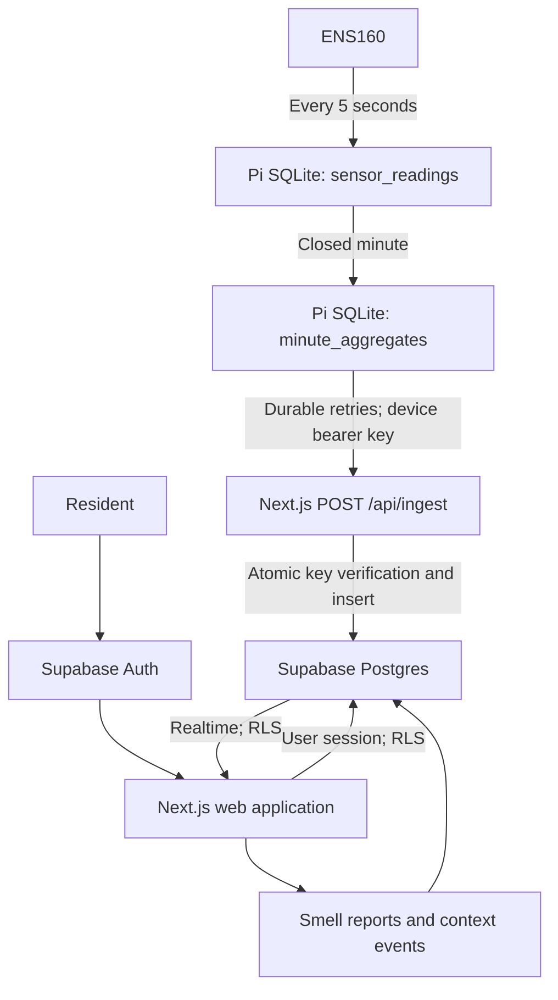

# Digital Nose

Digital Nose is an open-source distributed odour-monitoring platform combining low-cost edge sensors, Raspberry Pi telemetry, resident observations, and cloud analytics.

Licensed under Apache License 2.0.

V1 connects one-minute ENS160 aggregates with short resident smell reports and timestamped window/occupancy context. Sensor measurements remain the primary record; observations provide context and labels for future analysis.

## Architecture



Next.js App Router, TypeScript, Tailwind CSS, Supabase Postgres/Auth/Realtime. No ORM, queue, external charting package, or global state library. The chart plots every selected minute without smoothing; missing minutes remain gaps. eCO₂ is an equivalent estimate from ENS160, not a direct CO₂ measurement.

## Local development

Requirements: Node.js 22.12+ and npm. Python 3.10+ is needed only for the Pi tests.

```sh
npm ci
cp .env.example .env  # only if .env does not already exist
# Fill in the variables below.
npm run dev
```

Open `http://localhost:3000`. The public `/demo` route works without a connected sensor or migrated database. It displays clearly labelled illustrative data; its context and report controls do not write to Supabase.

The local `.env` is ignored by Git. Never overwrite an existing `DEVICE_KEY_PEPPER`: changing it invalidates every device key.

| Variable                        | Purpose                                                                              |
| ------------------------------- | ------------------------------------------------------------------------------------ |
| `NEXT_PUBLIC_SUPABASE_URL`      | Your Supabase project URL                                                            |
| `NEXT_PUBLIC_SUPABASE_ANON_KEY` | Supabase **publishable** key (or legacy anon key); compatibility variable name       |
| `SUPABASE_SERVICE_ROLE_KEY`     | Supabase **secret** key (or legacy service-role key); server-only compatibility name |
| `DEVICE_KEY_PEPPER`             | At least 32 random characters; generate with `openssl rand -hex 32`                  |
| `NEXT_PUBLIC_APP_URL`           | Canonical application origin, e.g. `http://localhost:3000` or your HTTPS deployment  |

Only variables prefixed `NEXT_PUBLIC_` may enter browser code. The privileged Supabase client imports `server-only`. The ingestion endpoint uses the server secret; resident requests use the resident session and RLS.

## Supabase setup

Apply the versioned migrations through the Supabase CLI. The CLI tracks previously applied migrations.

API keys configure the app; **they cannot apply database migrations**. Use the Supabase CLI with your project management access and database password:

```sh
npx supabase login
npx supabase link --project-ref YOUR_PROJECT_REF
npx supabase db push
```

Review the linked project before pushing. This installs the versioned files in `supabase/migrations/` in order: domain schema and RLS, atomic ingestion, Realtime publication, and the owner-only resident directory. No Docker is required for this hosted workflow. `supabase/config.toml` also describes the project for CLI use.

Alternatively run the migration files in order in the project's SQL editor, each inside a transaction. If you use the SQL editor, reconcile the CLI migration history with `supabase migration repair --status applied <version>` before later using `db push`.

In Supabase Auth:

1. Enable email/password sign-up and email confirmation.
2. Set the Site URL to `NEXT_PUBLIC_APP_URL` and allow `<origin>/auth/confirm` in Redirect URLs, for development and production origins you use.
3. After configuring custom SMTP (required by the hosted template editor), set the **Confirm signup** email link to `{{ .RedirectTo }}?token_hash={{ .TokenHash }}&type=email`. This supports confirmation on a different browser/device. The callback also supports a PKCE `code`.
4. Configure your production SMTP sender and appropriate Auth rate limits before inviting residents.

Create and confirm an account. On the first dashboard visit, create a site. Its creator becomes its owner in one database transaction. In Settings, give your profile a name, add a device, and generate its device key. The key is displayed once and only its peppered HMAC-SHA256 digest is stored. Rotation revokes previous keys atomically.

### Confirmation link recovery

An email can be confirmed even if automatic sign-in fails, for example when the default PKCE email link is opened in another browser. Sign in with the registered email and password in that case. Confirmation links are single-use; reopening one can return `otp_expired`. The login page explains these outcomes and offers **Resend confirmation email** for an unconfirmed account. Use only the newest link and open it in the browser used for signup. No account is automatically confirmed or password reset by this recovery flow.

### Residents

V1 uses a simple invitation process: the owner shares the displayed sign-up URL, the resident signs up, and the owner adds that registered email in Settings. No mail provider or invitation table is required. Owners can remove residents; residents cannot change membership or device settings. Owner removal/transfer is deliberately not exposed in V1, preventing accidental removal of the last owner.

### Optional database demo data

The `/demo` route needs no seeding. To populate a separate, explicitly labelled demo site for an **existing account**:

```sh
npm run seed -- your-registered-email@example.com
```

The seed writes 24 hours of minute aggregates and adds the account as owner of that demo site. It does not create accounts, send email, seed real device keys, or mix generated values into a real site. Use a development Supabase project for database demos.

## Daily use

- **Dashboard:** select a site/device, view latest readings and 6H / 24H / 7D history, and switch between TVOC, eCO₂ and AQI. A table exposes the latest 60 measurements for accessibility.
- **I can smell it:** choose intensity 1–5 and optionally a smell type or note. The database records the event time.
- **Context:** window state is shared by the site; occupancy is the signed-in resident's own latest state. An unrecorded value is shown as unknown. Every change appends an event; there is no persistent `smell_present` flag.
- **Reports:** recent observations with access to older pages.
- **Settings:** profile, site details, residents, device metadata and key rotation/revocation. Owner controls are checked again server-side and by the database.

All timestamps are stored in UTC and displayed in the site's named local timezone, initially Europe/London (including daylight saving changes). The latest minute's age determines freshness; stale values are labelled after three minutes. A successfully replayed old upload does not make an old measurement look live.

Realtime subscribes to the active device's aggregates and the site's reports/context. Reconnection and a one-minute polling fallback recover missed changes without requiring a page reload. Supabase RLS controls Realtime visibility too.

## Raspberry Pi setup

See [the Pi guide](docs/raspberry-pi.md). The existing edge system can keep collecting; the included scripts are a reference implementation. **Back up and inspect an existing SQLite schema before integrating**: do not point these scripts at an unknown database or run a second collector against the same sensor.

The Pi receives only its device identifier, application ingest URL and device API key. It never receives the Supabase server secret. Raw five-second measurements remain local.

## Ingest contract

`POST /api/ingest`, `Content-Type: application/json`, `Authorization: Bearer <device-key>`.

```json
{
  "device_identifier": "diginose-001",
  "minute_start_utc": "2026-09-12T02:10:00Z",
  "tvoc_mean": 180.2,
  "tvoc_min": 165,
  "tvoc_max": 201,
  "eco2_mean": 651.3,
  "eco2_min": 630,
  "eco2_max": 670,
  "aqi_max": 2,
  "sample_count": 12
}
```

A successful upload returns `200 {"ok":true}`, including retries of a previously stored minute. The first accepted aggregate is immutable: duplicates are ignored. Key verification, insertion and `last_seen_at` update are atomic. Revoked keys and keys belonging to another device return 401. Bodies are limited to 4 KiB; timestamps must align to a UTC minute; bounds and min/mean/max relationships are validated. Partial minutes with 1–12 valid samples are accepted.

Errors: 400 invalid payload, 401 invalid credentials, 413 oversized body, 415 wrong content type, 503 temporary ingestion/configuration failure. The sync client retains unacknowledged rows and retries with capped exponential backoff. A batch consists of up to 50 individual minute requests, matching the single-record endpoint.

## Deploy to Vercel

1. Import this Git repository into Vercel using the Next.js preset and Node.js 22 or later. The repository root is the app root.
2. Set all five environment variables for the deployment environment. Set `NEXT_PUBLIC_APP_URL` to the final HTTPS origin. Keep the pepper stable and server secrets out of preview environments that do not need production access.
3. Apply the Supabase migrations and configure Auth URLs/email as described above.
4. Run `npm run check`, `npm run test:pi`, and `npm run build` before deploying.
5. Deploy. Sign up, confirm the account, create the site/device, and provision the Pi key through Settings.
6. Verify a real upload, a retry, a revoked key, and a live dashboard in the deployed environment. Use Vercel's platform request controls if the public endpoint receives abusive traffic.

Do not cache authenticated pages at a CDN. The app marks session responses private/no-store. Its server actions use Next.js origin checks; production origin configuration must match the deployment.

## Security and validation

See [security model](docs/security.md) and [verification](docs/verification.md).

```sh
npm run check          # ESLint, TypeScript, Node tests including real Postgres RLS via PGlite
npm run test:pi        # SQLite aggregation, retry, outbox and failure tests
npm run build         # Production Next.js build
npm run format:check
```

PGlite is a development-only embedded PostgreSQL test dependency. Tests create roles, Auth stubs and isolated databases, then execute the real schema and ingestion migrations. They do not contact or modify your hosted project. Production continues to use Supabase only.

## Author

Digital Nose was created by Piotr Wolanski.

## License

Licensed under the Apache License 2.0.
See [LICENSE](LICENSE) and [NOTICE](NOTICE) for details.

## Weather context

Weather data by [Open-Meteo](https://open-meteo.com/) adds external, model-based atmospheric context. It is separate from ENS160 hardware measurements and does not establish the cause of an odour. The Raspberry Pi, its SQLite data and `/api/ingest` are unchanged; the Pi never calls Open-Meteo.

- **Provider/tier:** Open-Meteo free/open-access API (`https://api.open-meteo.com`), for the current non-commercial V1. No API key.
- **Model:** `best_match`. This is the requested model selection strategy, not a claim that a particular UK model supplied a row. Only non-location provider metadata is retained.
- **Refresh:** Vercel Cron calls `GET /api/weather/refresh` every 15 minutes. This frequency requires **Vercel Pro**; Hobby only supports daily cron. Do not also schedule the route in Supabase Cron.
- **Location:** site latitude/longitude, manually configured by its owner in Settings. Both must be present (latitude −90…90, longitude −180…180). Clearing both disables acquisition. Coordinates are sent to Open-Meteo; there is no runtime postcode lookup.
- **Storage:** separate `public.weather_observations` table. Timestamp comes from Open-Meteo's `current.time`, requested in UTC, and is stored as `timestamptz`. Repeated timestamps are upserted on `(site_id, observed_at_utc, source)`.
- **Variables:** temperature at 2m (°C), relative humidity at 2m (%), surface pressure (hPa), precipitation (mm), wind speed/gusts at 10m (km/h), wind direction (raw degrees) and WMO weather code. Only `current` fields are fetched; no multi-day forecasts.
- **Wind:** direction is **from** the bearing, e.g. 225° means from SW. It does not mean towards SW.
- **Freshness:** fresh at ≤30 minutes; older rows remain visible with a stale label. Missing fields show `—`, never invented zeroes. The chart inspector selects the nearest stored weather row within ±15 minutes; it never interpolates. Sensor gaps and context overlays are preserved.

Site members can read weather under the existing membership RLS pattern. Browser roles cannot insert, update or delete weather. The cron authenticates `Authorization: Bearer <CRON_SECRET>` before creating the server-only Supabase client. Missing/wrong credentials return 401. Weather fetches have a 10-second timeout, four bounded workers, no automatic retries and at most one provider call per distinct configured site per invocation. An individual provider/write failure is logged without raw payloads/secrets, other sites continue, and the JSON summary reports `ok`, `sites`, `upserted`, `failed`, and `skipped`. Weather database query failures do not reject the sensor dashboard loader.

Dashboard visitors only read Supabase: 100 residents generate **zero extra Open-Meteo calls**. A regular schedule uses 96 calls/day/site, approximately 2,880 calls per 30-day month/site (28,800 for ten sites). Published free limits checked for V1: 600/minute, 5,000/hour, 10,000/day, 300,000/month. Manual invocations and retries also consume this quota; avoid duplicate schedules and review capacity before adding many sites. The free service has no uptime guarantee. [Provider pricing/limits](https://open-meteo.com/en/pricing). **Review provider licensing before commercial deployment.**

### Weather deployment

1. Apply `supabase/migrations/202609120005_weather.sql` before deploying the updated Settings page. It adds coordinate constraints, the weather table/index and RLS. No existing telemetry is migrated.
2. Generate a high-entropy `CRON_SECRET` (e.g. `openssl rand -hex 32`) and configure it in Vercel's **Production** environment. Keep it server-only. `.env.example` documents the variable; do not commit its value. Use a separate local `.env` value if testing locally.
3. Confirm Vercel Pro supports the requested schedule, then deploy `vercel.json`. Vercel supplies the bearer header from `CRON_SECRET`. Cron runs on production deployments, not the local Next.js server.
4. Configure weather coordinates in Settings. Coordinate access is limited to site owners and the weather backend.
5. Invoke the protected route once using the bearer header, check its compact summary, then verify a row and the dashboard attribution. Check Vercel's Cron logs for the next scheduled invocation. Do not expose or paste the secret in logs, screenshots or URLs.

If the migration, coordinates, cron secret or supported scheduler plan is missing, weather acquisition is not operational yet. The dashboard displays missing/unavailable weather while hardware telemetry continues independently. There is no weather backfill in V1: historical context accumulates from scheduled observations.
